# PDF Studio — rendered Qt UX audit

30 September 2026. Baseline: PR #6 at `2f88a449f664def1b3c12b5bc312255f82a6dfd1`.

The earlier preview repair was not a complete UX check. This pass captured the
actual QML screens and fixed issues visible in the rendering: a blank first-use
experience, small controls, hard-to-read page scaling, a vertical table editor,
single-line addresses, an inconsistent File menu and missing inline invoice PDFs.

This is a functioning document editor, but it is not yet a polished, direct
on-page design tool. The main remaining interaction gaps are inspector-only text
editing, explicit PDF refresh, hex-only colour entry and limited table editing.
Those are product limitations, not silently treated as completed work.

## Evidence and scope

`tests/ux-audit.py` renders the production QML using Qt 6.8.3 software rendering.
It loads Omarchy's actual Button, BorderSurface, BorderOverlay and style
computations from upstream `b421b1b479ee9ea0863792282eee4ffeb50923dc`.
The palette is a controlled dark fixture. Hyprland watchers, Quickshell windows
and Process transport are substituted. The PDF renderer, storage and image
import helper are real; fixture data is fictional and stored in temporary folders.
Some actions use production QML functions rather than mouse events. Existing Qt
interaction tests supply real typing, pointer drag/resize and keyboard checks.

Screens were inspected at 1280×850, 1040×850 and 900×650. Scrollable page content
extending below the viewport is intentional. Before captures are in `before/`;
the accepted final captures are in `after/`.

## Workflow results

| Step | Flow | Health |
| --- | --- | --- |
| 1 | Start a blank document | Improved |
| 2 | Write and arrange content | Improved |
| 3 | Edit a table | Improved |
| 4 | Configure the page | Usable |
| 5 | Save and reopen a document | Pass with limits |
| 6 | Export a document PDF | Pass |
| 7 | Use the designer at 900×650 | Usable, dense |
| 8 | Recover from a missing preview image | Pass |
| 9 | Close with unsaved changes | Pass |
| 10 | Enter invoice details | Improved |
| 11 | Use the invoice form at 900×650 | Usable with scrolling |
| 12 | Preview and export an invoice | Fixed |
| 13 | Import and position an image | Pass with limits |
| 14 | Find document and invoice actions | Improved |

## What changed

- New blank documents start in free layout; existing documents and presets keep their modes.
- Canvas and PDF views offer fit-page and fit-width scrolling. Selecting a block scrolls it into view when needed.
- Designer controls are taller; table cells form a grid; text fields have visible boundaries.
- Delete/Backspace removes a selected canvas block; Ctrl+D duplicates it. The resize handle has a 24px hit area.
- Invoice addresses, payment details and notes preserve line breaks.
- Invoices now have an inline PDF tab and page navigation, using the same bounded raster helper as the designer.
- Preview tests check actual visible page size, not only successful image decoding.

## Accessibility and evidence limits

Keyboard drag alternatives (coordinates and nudging), undo/redo and modal focus
protection work in the Qt fixture. Buttons and important fields now expose names;
canvas and PDF surfaces expose roles. This is not an accessibility conformance
claim. Screen-reader announcements, selection order, text scaling, light themes,
contrast across user themes, touchpad gestures and native file-dialog focus are
unverified. A 24px resize target helps pointer use but is not a touch-first UI.

Live Omarchy process transport, theme changes, native file picker, external PDF
viewer, monitor placement and reload remain on-device checks. The original
reported blank-preview cause on Tom's XPS is not established. Marketplace
readiness is not implied.

## Captured steps

### 1. Start a blank document — Improved

Previously an empty preview area sent the user into Page setup to discover free positioning. A new blank document now opens directly onto a free canvas. Insert remains the entry point. Flow presets are unchanged.

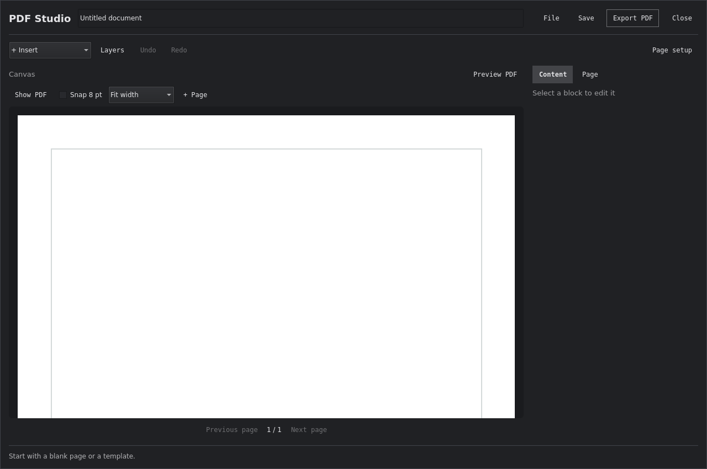

### 2. Write and arrange content — Improved

Fit-to-width makes the page readable, with vertical scrolling. Text areas now have visible boundaries; actions and fields have larger targets. Content still edits in the inspector rather than directly on the page.

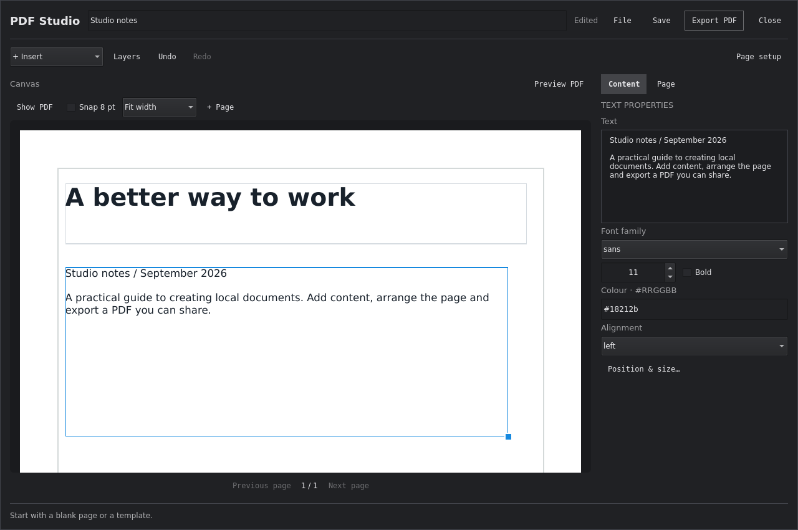

### 3. Edit a table — Improved

Cells are now arranged in rows and columns instead of a vertical list. Wider tables scroll horizontally. A long table no longer pushes every typography control far below the viewport. Full spreadsheet selection and paste are not implemented.

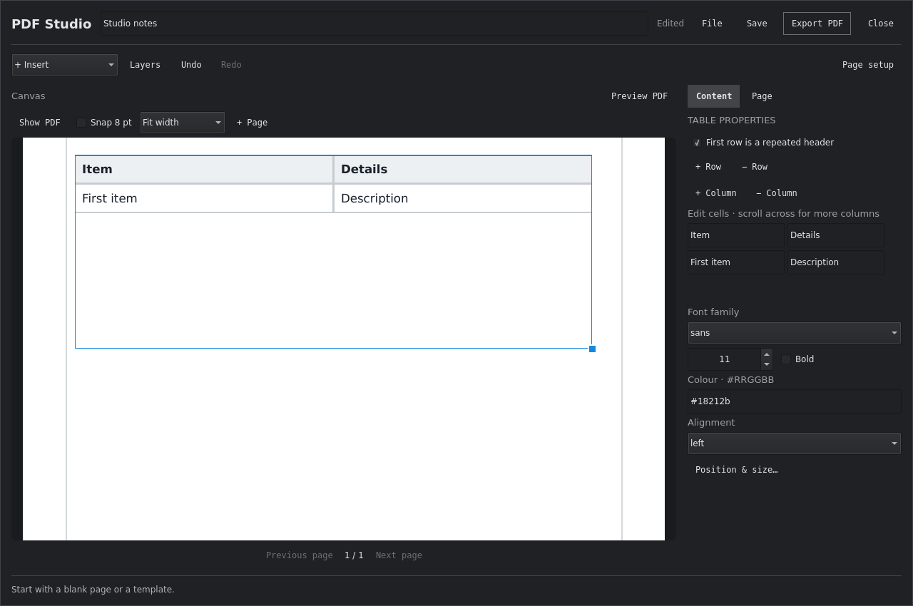

### 4. Configure the page — Usable

Page settings remain separate from content. Clicking another block returns to Content. Layout conversion, page bounds and undo are covered by state tests. Hex colour fields remain less approachable than a colour picker.

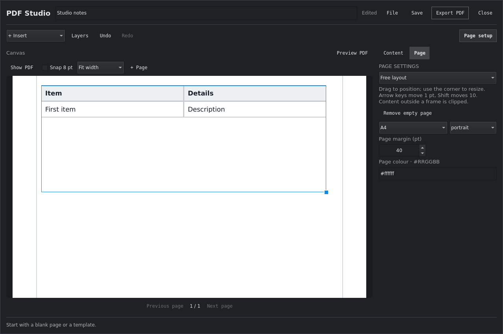

### 5. Save and reopen a document — Pass with limits

The shipped helper saved, listed and reopened the same document without changing its contents. The screenshot shows the populated picker. This capture sets picker data from the helper; it is not a complete automated native-menu click-through for save/reopen or templates.

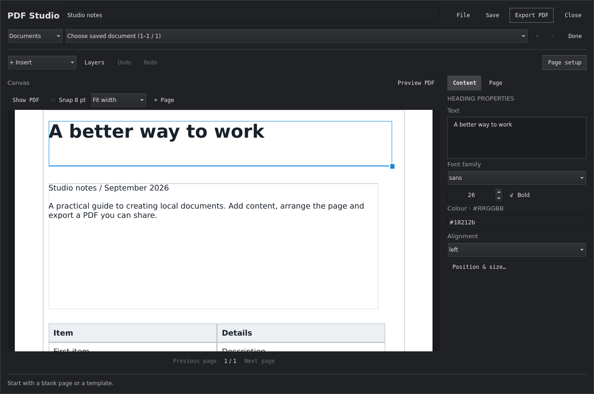

### 6. Export a document PDF — Pass

The actual renderer output appears inside the editor. Fit-to-width allows inspection of typography, with scrolling for the rest of the page. Fit-page remains available. Refresh is explicit, and export does not save the editable document.

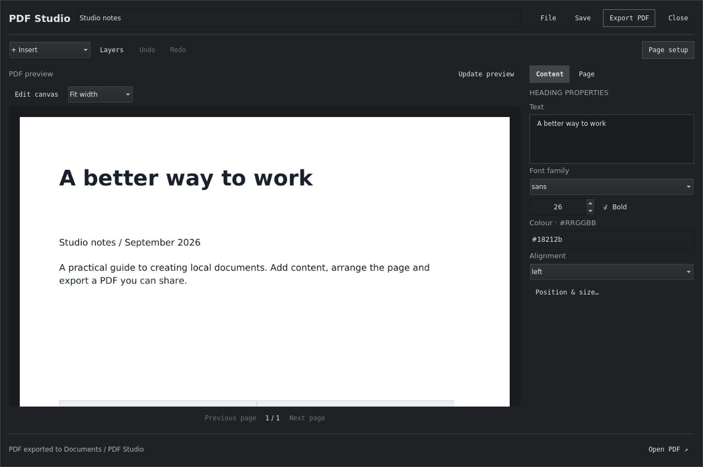

### 7. Use the designer at 900×650 — Usable, dense

File actions, layers, preview and inspector remain inside the window. Showing layers leaves less page space; hiding them is the practical option. Screens below this size and unusually large desktop font scales were not verified.

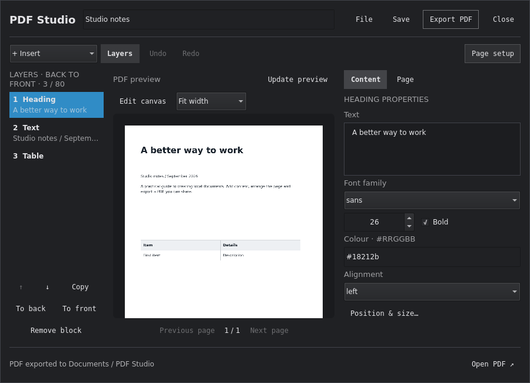

### 8. Recover from a missing preview image — Pass

An intentionally missing image produces an explanation and a retry action. The generated PDF link remains available. The audit deliberately produces one Qt missing-file diagnostic for this state.

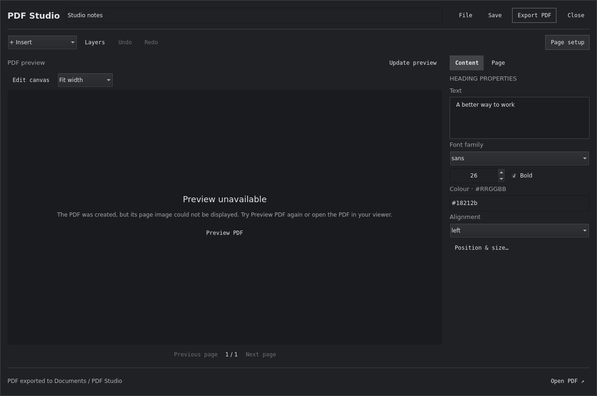

### 9. Close with unsaved changes — Pass

Save, Discard and Cancel are explicit. Real Qt keyboard tests verify focus trapping, Escape cancellation and that Ctrl+S cannot bypass the dialog. Destructive navigation tests preserve edits on failure.

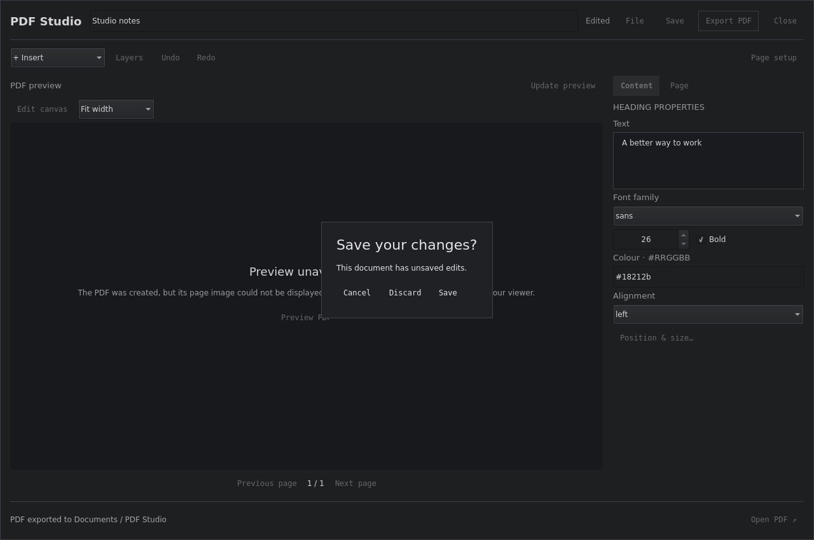

### 10. Enter invoice details — Improved

Addresses, payment details and notes are now multiline fields with visible boundaries. Ordinary fields are taller and have accessible names. Calculation remains an explicit action; validation errors are still reported in the status area rather than alongside each field.

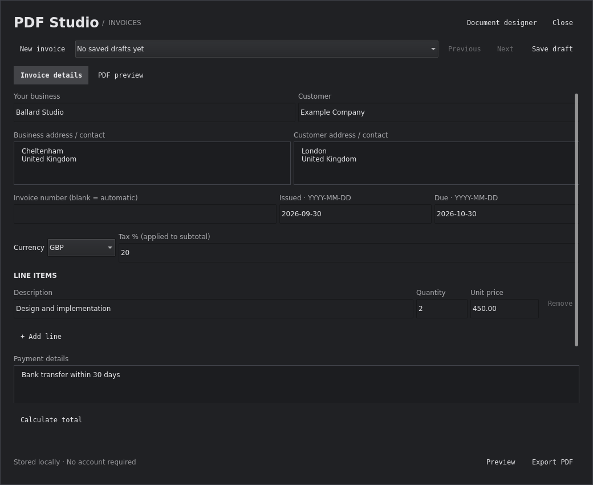

### 11. Use the invoice form at 900×650 — Usable with scrolling

The form scrolls while its actions stay visible. A persistent scrollbar indicates more content. Line items and notes are below the initial fold at this size.

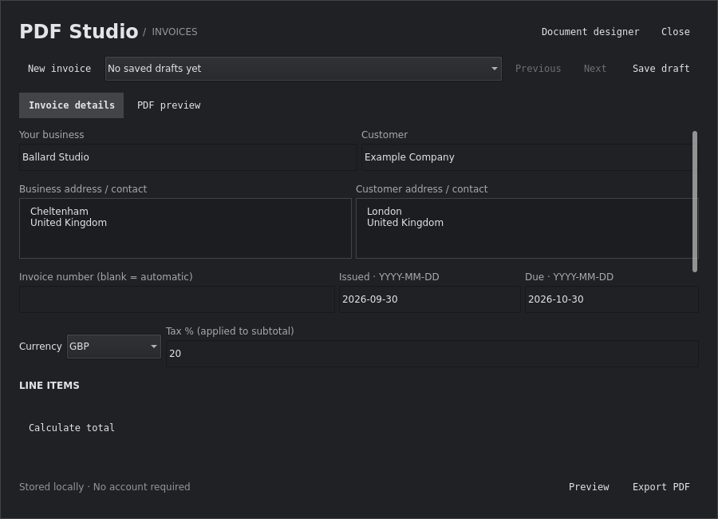

### 12. Preview and export an invoice — Fixed

Both actions now show the generated PDF in the plugin. An intermediate layout regression loaded the image but reduced it to a narrow strip; this was found visually, fixed, and added to tests through a minimum displayed image-height assertion. Multipage selection is covered by a real-renderer test.

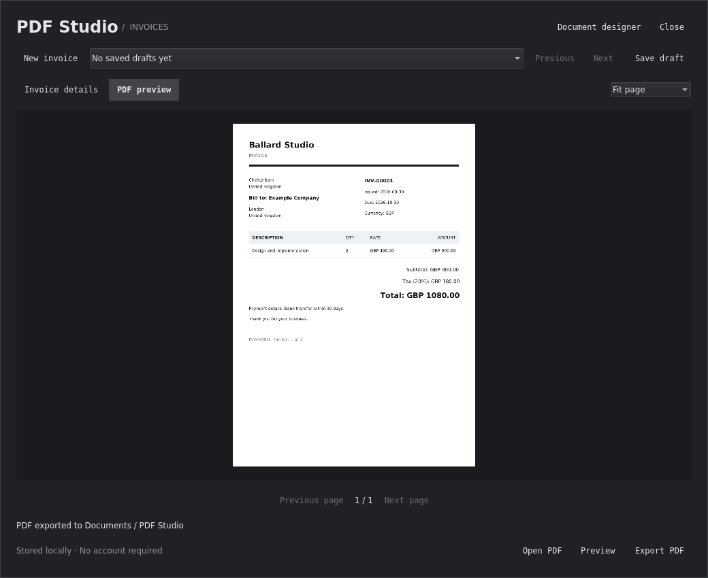

### 13. Import and position an image — Pass with limits

The shipped helper imports a PNG and the canvas displays the managed copy. The fixture uses the existing fictional invoice screenshot as an image. The native file chooser and its Wayland portal were not exercised.

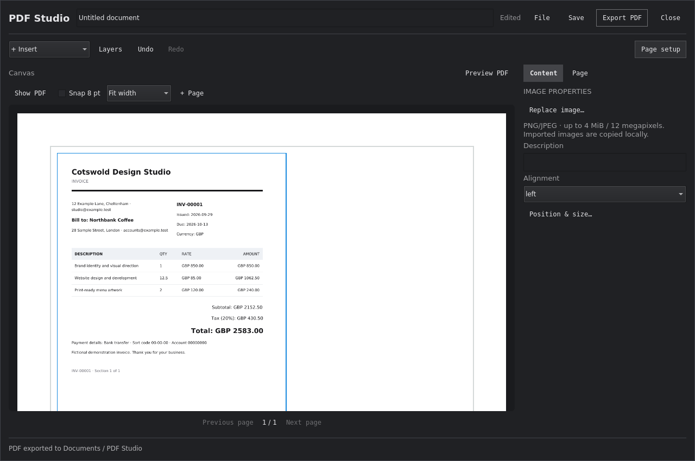

### 14. Find document and invoice actions — Improved

The File menu now follows the popup palette rather than displaying a white menu on a dark editor. Its width is explicit so replacing the background cannot collapse the menu. Native-menu focus and screen-reader reading order still need an on-device check.

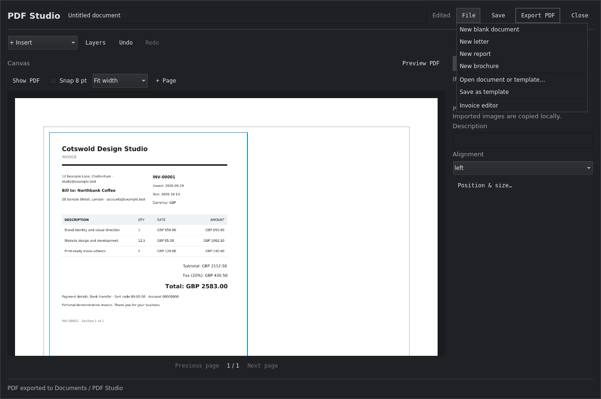

## Validation

- 34 Node tests, TypeScript checking, manifest validation and bundle reproducibility pass locally.
- All three offscreen Qt runs pass: invoice, flow designer and free-layout designer.
- Preview and Export are rendered by the shipped helper and displayed by Qt in both editors.
- Real-renderer coverage includes a multipage invoice and an unwritable preview cache.
- No warning-free claim is made for the audit's intentional missing-image state.

Reproduce the captures with a checkout of the stated Omarchy revision:

```bash
python3 tests/ux-audit.py --output docs/ux-audit/after --host ../omarchy-upstream
```
